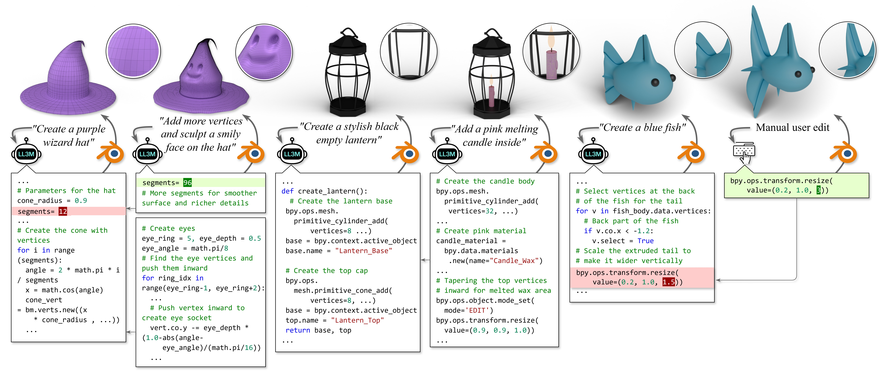

# LL3M


<br>

[](https://threedle.github.io/ll3m/)




## Roadmap  
- [Abstract](#abstract)
- [LL3M Setup](#ll3m-setup)  
- [Blender Setup](#blender-setup) 
- [Authentication](#authentication) 
- [Demo](#demo)  
- [Limitation](#limitation)
- [Frequently Asked Questions (FAQ)](#frequently-asked-questions-faq)
- [Feedback](#feedback)
- [BibTeX](#bibtex)


## Abstract
We present LL3M, a multi-agent system that leverages pretrained large language models (LLMs) to generate 3D assets by writing interpretable Python code in Blender. We break away from the typical generative approach that learns from a collection of 3D data. Instead, we reformulate shape generation as a code-writing task, enabling greater modularity, editability, and integration with artist workflows. Given a text prompt, LL3M coordinates a team of specialized LLM agents to plan, retrieve, write, debug, and refine Blender scripts that generate and edit geometry and appearance. The generated code serves as a high-level, interpretable, human-readable, well-documented representation of scenes and objects, making full use of sophisticated Blender constructs (e.g., BMesh, geometry modifiers, shader nodes) for diverse, unconstrained shapes, materials, and scenes. This code presents many avenues for further agent and human editing and experimentation via code tweaks or procedural parameters. This medium naturally enables a co‑creative loop in our system: agents can automatically self‑critique using code and visuals, while iterative user instructions provide an intuitive way to refine assets. A shared code context across agents enables awareness of previous attempts, and a retrieval‑augmented generation knowledge base built from Blender API documentation (BlenderRAG) equips agents with examples, types, and functions, enabling advanced modeling operations and improving code correctness. We demonstrate the effectiveness of LL3M across diverse shape categories, style and material edits, and user‑driven refinements. Our experiments showcase the power of code as a generative and interpretable medium for 3D asset creation.

## LL3M Setup 

> To get started, make sure both Blender and LL3M are running on the same machine.

### Requirements 

| **Minimum Requirements** | **Recommended Requirements** |
|--------------------------|------------------------------|
| **OS:** Windows 10/11, macOS 10.15+, or Linux (Ubuntu 18.04+) | **OS:** Windows 11, macOS 12+, or Linux (Ubuntu 20.04+) |
| **CPU:** Intel Core i5-8400 / AMD Ryzen 5 2600 or equivalent | **CPU:** Intel Core i7-10700K / AMD Ryzen 7 3700X or better |
| **RAM:** 8 GB | **RAM:** 16 GB (32 GB for complex scenes) |
| **GPU:** DirectX 11 compatible graphics card with 2GB VRAM | **GPU:** NVIDIA RTX 3060 / AMD RX 6600 XT or better with 8GB+ VRAM |
| **Storage:** 5 GB free space | **Storage:** 10 GB free space (SSD recommended) |


### Installation

1. Clone the repository: 

```bash
git clone https://github.com/threedle/ll3m.git
cd ll3m
```

2. Create and activate a conda environment:

```bash
conda create -n ll3m python=3.12 -y
conda activate ll3m
```


3. Install the required packages:
```bash
pip install -r requirements.txt
```

## Blender Setup 

We used [Blender 4.4](https://www.blender.org/download/releases/4-4/) in our experiments.

### Install Blender 4.4 

Download Blender 4.4 [here](https://www.blender.org/download/releases/4-4/).

You can find the appropriate installer for your operating system [here](https://download.blender.org/release/Blender4.4/).

> The specific Blender version does not matter, any Blender 4.4.x release will work.

### Install the LL3M Blender Addon

1. Locate the `./blender/addon.py` file in this repository.

2. Open Blender.

3. Go to Edit > Preferences > Add-ons.


4. Click on the arrow on the right > "Install from Disc...", and select the `./blender/addon.py` file.


5. Enable the addon by checking the box next to "LL3M Blender" and close the Preferences window.

6. If you close and reopen Blender and the "LL3M Blender" add-on does not appear, go to Edit > Preferences > Add-ons, and enable it again.


### Enable the Blender Addon

7. In Blender, go to the 3D View sidebar (press N if not visible).


8. Click the "LL3M" tab, then click "Start LL3M Server".


When you see "Running on port 8888", you can proceed.

---

## Authentication

LL3M is a client-server application. For this demo, you need an account to use it.

> **Note**: Each account is limited to 5 requests per day.

### Login
  ```bash
  python main.py --login
  ``` 
This opens a browser window for sign‑in. After success, tokens are stored locally and used automatically by `main.py`.

### Accept Terms

Before using the LL3M service, you must accept the terms and conditions.

  ```bash
  python main.py --accept-terms
  ``` 

You'll be prompted to type "yes" to confirm your agreement.

> You only need to accept the terms and conditions once; they do not expire.


### Logout

  ```bash
  python main.py --logout
  ```
Use this to remove tokens from your machine, or if you need to switch accounts.


> Authentication tokens are valid for one hour. When your token expires, simply rerun `--login` to sign in again.

**Privacy Notice**: Your account information is used solely for authentication purposes with the LL3M service. LL3M does not access, store, or utilize your account credentials for any other purpose beyond verifying your identity and enabling access to the service.

---

## Configuration

The LL3M client can be customized through the `config/config.yaml` file. Here's a quick reference for all available settings:

### Customizable Configuration Settings

| Section | Setting | Default | Options | Description |
|---------|---------|---------|---------|-------------|
| `blender` | `headless_rendering` | `false` | `true`/`false` | Enable headless rendering in Blender |
| `blender` | `gpu_rendering` | `false` | `true`/`false` | Use GPU acceleration (faster if compatible GPU available) |
| `render` | `num_images` | `5` | `1-10` | Number of images to render per instruction |
| `render` | `resolution_scale` | `1` | `0.1-1.0` | Image resolution (1.0 = 1920x1080, 0.5 = 960x540) |

Configure this file before you run `main.py`.

> If your hardware is low-end or you experience slow performance, consider lowering the `num_images` or reducing the `resolution_scale` in `config/config.yaml` to improve speed and stability.


---

## Demo

### Before you start

Double-check the following:

- Blender is open with LL3M enabled. If not, see [Blender setup](#blender-setup).
- You have successfully logged in. If not, see [Login](#login).
- You have accepted the Terms and Conditions. If not, see [Accept Terms](#accept-terms).
- Optional: the configuration `config/config.yaml` is set for customiziable rendering. If not, see [Configuration](#configuration).

### Usage
```bash
# Use text prompt
python main.py --text "Create a 3D object of a chair"

# Use image as input
python main.py --image /path/to/chair.png

# Get help
python main.py --help
```

> `--text` and `--image` are mutually exclusive, meaning you can only choose one. This is to prevent mismatches between text and image inputs.

### Console Messages

During execution, you may see messages such as the following:

```txt
===== Executing Blender code from server =====
import bpy
scene = bpy.context.scene
_ = len(bpy.data.objects)
print(f'Blender preflight OK: scene={scene.name}, objects={_}')
===== End snippet =====
```
This indicates the client received a Blender Python (bpy) script from the server. The script will now be executed in Blender.

```txt
[Client] [OK] Blender code executed successfully! Waiting for next action from server...
```
Execution succeeded. The client is waiting for the next instruction from the server.

```txt
[Client] [RETRY] Blender code execution failed. Waiting for server to provide corrected version...
   Error details: 'bpy_prop_collection[key]: key "Specular" not found'
```
This indicates execution failed. The error is returned to the server, which will respond with a corrected script.

```txt
[Initial Creation Phase: 0:01:00]
[Auto Refinement Phase: 0:01:00]
[User Guided Refinement Phase: 0:01:00]
```
These lines show the elapsed time for each phase.


For complex prompts, LL3M may require additional time. Continue waiting for the next instruction.

```txt
[Client] Render resolution: 1920 x 1080 (base 1920x1080 @ 100%)
[Client] Rendering method: CPU rendering (config setting)
[Client] Uploading 5 rendered images (prefix=render) to server...
[Client] Upload complete: 5 images uploaded.
[Client] [OK] Blender code executed successfully! Waiting for next action from server...
```

This indicates Blender is rendering images according to your [configuration](#configuration) settings. Rendering can be computationally intensive and may temporarily freeze Blender. For details, see the [Frequently Asked Questions (FAQ)](#frequently-asked-questions-faq).


**Indication for User Guided Refinement**

```txt
[Phase] user_guided_refinement
[User Guided Refinement Phase: 0:00:00]
Enter the instruction: (Type 'TERMINATE' to exit) 
(Type TERMINATE to exit)
[WARNING: Session will timeout after 3 minutes of inactivity]
<ENTER YOUR INPUT HERE>
```

This indicates the program has entered the user‑guided refinement phase and is waiting for input. Provide instructions to refine the 3D object, or type `TERMINATE` to end the session.

**Exit the program**

Type `TERMINATE` during the User‑Guided Refinement phase to exit gracefully.
> The command must be all capital letters: `TERMINATE`. You can also exit by pressing `Ctrl + C`. 


**More examples**

> Once you are able to get the system to run successfully, you can try more interesting examples. Here are some diverse prompts to experiment with:

```bash
# Furniture and Objects
python main.py --text "create a 3D object of a chair"
# User-guided refinement suggestions:
#   • "add 2 armrests on the chair"
#   • "change the texture to wooden with dark brown color"

# Cultural and Decorative Items
python main.py --text "create a 3D object of a stylish Chinese lantern with red silk material, golden trim, and intricate carved wooden frame"
# User-guided refinement suggestions:
#   • "add a small golden tassel hanging from the bottom"
#   • "make the red silk material more translucent and glowing"

# Animals and Creatures
python main.py --text "create a 3D object of a cartoon blue fish with streamlined body, large expressive eyes, flowing tail fins, and shimmering scales with subtle iridescent highlights"
# User-guided refinement suggestions:
#   • "add small bubbles around the fish"
#   • "make the scales more metallic and reflective"
 
# Vehicles and Transportation
python main.py --text "create a 3D object of a skateboard with wooden deck, colorful grip tape, metal trucks, and smooth wheels with detailed bearings"
# User-guided refinement suggestions:
#   • "add a cool graphic design pattern on the deck"
#   • "make the wheels glow with neon colors"

# Nature and Landscapes
python main.py --text "create a 3D object of a bonsai tree with twisted trunk, small green leaves, and moss-covered rocks in a ceramic pot"
# User-guided refinement suggestions:
#   • "add small cherry blossoms on the branches"
#   • "make the ceramic pot more ornate with traditional patterns"

# Fantasy and Sci-Fi
python main.py --text "create a 3D object of a crystal sword with translucent blue blade, silver hilt with gemstone decorations"
# User-guided refinement suggestions:
#   • "add lightning effects around the blade"
#   • "make the gemstones pulse with different colors"
```

> Due to the random seedings of LLMs, you might get various results with the same prompt. See [limitations](#limitation). 


### Resume from a terminated session

You can continue working on previous sessions by using the session refinement feature. This allows you to take a completed session and apply new modifications without starting from scratch.

#### List your sessions

First, see all your available sessions:

```bash
python main.py --list-sessions
```

This will display all session IDs that you own and have completed successfully (containing a `draft.py` file).

#### Resume from a specific session

To continue working on a previous session, use the `--session-id` and `--prompt` flags together:

```bash
python main.py --session-id "abc123def456789..." --prompt "add armrests to the chair"
```

**Important notes:**
- Both `--session-id` and `--prompt` must be provided together
- The session must be owned by you (authenticated user)
- The session must have completed successfully (containing a `draft.py` file)
- This creates a **new session** based on your previous work
- This consumes one of your daily requests

**Example workflow**

```bash
# 1. List your available sessions
python main.py --list-sessions
# Output: ['abc123def456789...', 'def456ghi789012...']

# 2. Resume from a specific session with new instructions
python main.py --session-id "abc123def456789..." --prompt "change the chair color to red and add a cushion"

# 3. The system will:
#    - Load the final script from your previous session
#    - Apply your new refinement prompt
#    - Create a new session with the updated design
```


## Limitation

The coding LLM may occasionally hallucinate or generate different results for the same prompt. To improve consistency, try providing more detailed prompts, such as `create a simple wooden-colored chair with 4 legs, 1 seat and 1 backrest`.

Random seeds can lead to variations in quality. You may not reproduce the exact same results from the paper. If you get a poor result, try running it several more times.

## Frequently Asked Questions (FAQ)

**Q: My Blender freezes during the running process, what should I do?**  
A: Complex Blender operations like rendering can be computationally intensive and may cause Blender or your entire computer to freeze temporarily. If the program crushes during the rendering, we recommend reducing the `num_images` and `resolution_scale` parameters to lower the rendering workload. For more details, please see our [Configuration](#customizable-configuration-settings) section. 

**Q: After I terminate the process, can I revert any changes during user-guided refinement?**  
A: Unfortunately, this demo version of LL3M does not currently support reverting changes made during user-guided refinement. Each run starts fresh from the beginning. 

**Q: Can I continue working on a previous session that I completed?**  
A: Yes! You can use the session refinement feature to continue working on previous sessions. Use `python main.py --list-sessions` to see all your available sessions, then use `python main.py --session-id "your_session_id" --prompt "your_new_instructions"` to continue from a specific session. This creates a new session based on your previous work, allowing you to apply additional modifications without starting from scratch. For detailed instructions, see our [Resume from a terminated session](#resume-from-a-terminated-session) section.


**Q: My run produced an unsatisfactory or flawed result. What should I do?**  
A: Occasionally, the LLM may generate unexpected or imperfect outputs due to hallucination (see [Limitation](#limitation)). If this happens, try providing additional follow-up prompts to refine the result, or simply re-run the program with the same prompt for a different outcome.

**Q: My code is not working, I have a feature request, or I have complaints. How do I reach out to the authors?**  
A: We appreciate your interest in LL3M and value your feedback. Please submit your feedback through our [feedback form](https://forms.gle/Ra5EpcTjBBF1tRdp9) for any issues, suggestions, or concerns you may have.

## Feedback

Help us improve LL3M! Share your feedback through our [feedback form](https://forms.gle/Ra5EpcTjBBF1tRdp9).

